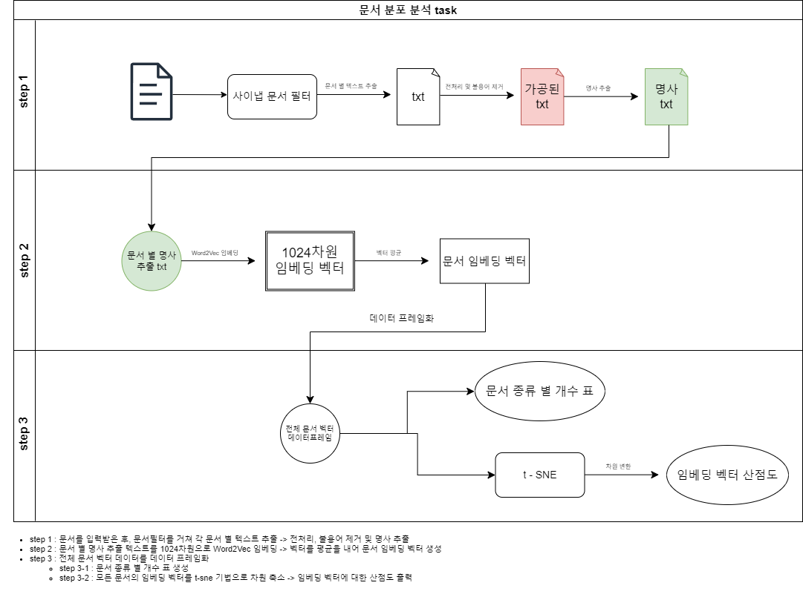

# 1. 목적 및 이슈

### 목적
    1. 전체 문서의 종류 별 개수 현황 파악
    2. 전체 문서의 종류 별 의미 기반 분포 파악
### 이슈
    - 3번 Task에서 생성된 문서 임베딩 벡터 필요

# 2. 산출물 및 결론

### 산출물
    1. 전체 문서의 종류 별 개수가 기입된 표
    2. 2차원 투영된 임베딩 벡터의 산점도 그래프
### 결론
    - Word2Vec의 t-SNE를 통한 2차원 투영을 통해 의미기반의 문서 분포 파악

# 3. 프로세스

> Step 1. Text 전처리 및 명사 추출

1. 원본 문서의 텍스트 추출 (사이냅 문서 필터)
2. 텍스트 전처리 및 불용어 제거
3. 명사 추출

> Step 2. 문서 임베딩 벡터화

1. 문서 별 명사 추출 텍스트의 Word2Vec 임베딩 (1024차원)
2. 임베딩 벡터 평균 —> 문서 임베딩 벡터
3. 모든 문서에 대한 벡터 정보 데이터프레임화

> Step 3. 차원 축소 및 산출물 산출

1. 전체 문서 정보 데이터프레임을 이용해 문서 종류 별 개수 표 생성
2. t-SNE를 활용해 모든 문서 임베딩 벡터 차원 축소 (1024차원 —> 2차원)
3. 차원 변환된 임베딩 벡터에 대한 산점도 출력

# 4. 개발 환경

- AWS
- Ubuntu 18.04.5 LTS
- Jupyter notebook
- T4 GPU 4개

# 5. 개발 사항

### 데이터
- 데이터 출처
    - LG 에너지 솔루션 자동차부문 문서 약 2만 3천건(Control Plan, Gate Review, BOM, PFMEA, DFMEA, 제품사양서, 도면) 중 90%
    - 3번 Task의 Word2Vec 문서 임베딩 벡터
- 데이터 포맷 및 예시
    - 포멧 : 데이터프레임
        - 구성요소 1 : 문서 별 Word2Vec 임베딩 벡터
        - 구성요소 2 : 문서 별 클래스 값
- 전처리 사항
    - 숫자 레이블을 문자열 레이블로 변환
        (예시) 5 → "제품사양서"
    - t-SNE 기법을 이용한 벡터 차원 변환 (1024차원 → 2차원)
    - 데이터 프레임 형태 변환
        - `전체 문서의 종류 별 개수가 기입된 표` 산출물을 위한 전처리
        - 카테고리 별로 문서 개수를 계산 후 정리

### 검증 사항
- 임베딩 벡터의 종류
- 차원 축소 기법

### 주요 라이브러리
- sklearn
- matplotlib
- seaborn
- pandas
- numpy